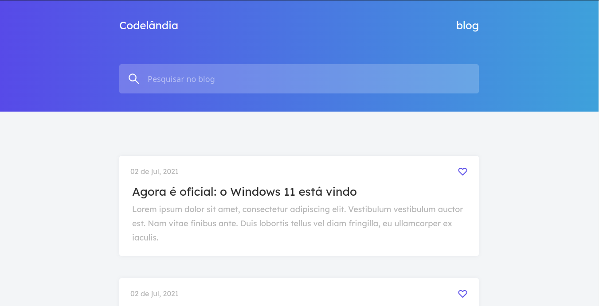
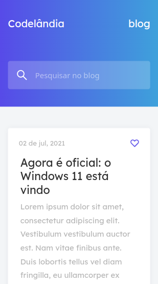

<h1 align="center">Codilândia Blog</h1>
<p align="center">O projeto é um desafio proposto pela comunidade <a href="https://discord.gg/wNCWTVuxyz">@Codilândia</a>
</p>
<p align="center">
  

  
  
  <a href="https://github.com/askagi/codilandia-blog/commits/master">
    
  </a>

   
   <a href="https://github.com/askagi/codilandia-blog">
    
  </a>
</p>

Tabela de conteúdos
=================
<!--ts-->
* [Sobre o projeto](#-sobre-o-projeto)
* [Layout](#-layout)
  * [Mobile](#mobile)
  * [Web](#web)
* [Como executar o projeto](#-como-executar-o-projeto)
* [Tecnologias](#-tecnologias)
* [Autor](#-autor)
* [Licença](#user-content--licença)
<!--te-->

## 💻 Sobre o projeto

📘️ Codelândia Blog - é uma página web de Blog desenvolvida com a finalidade de aplicar estudos praticar e ganhar experiência na área de frontend utilizando o ReactJs.

---

## 🎨 Layout

O layout da aplicação está disponível no Figma:
<p>
    <a href="https://discord.gg/wNCWTVuxyz">
    
  </a>
<a href="https://www.figma.com/file/Yb9IBH56g7T1hdIyZ3BMNO/Desafios---Codel%C3%A2ndia?node-id=39340%3A690">
  
</a>
</p>

### Web

<p align="">
  
</p>

### Web - Responsivo

<p align="center" style="display: flex; align-items: flex-start; justify-content: center;">
  
 
</p>

---

## 🚀 Como executar o projeto

```bash

# Clone este repositório
$ git clone git@github.com:askagi/codilandia-blog.git

# Acesse a pasta do projeto no seu terminal/cmd
$ cd codilandia-blog

# Instale as dependências
$ npm install

ou

$ yarn install

# Execute a aplicação em modo de desenvolvimento
$ npm run start

ou

$ yarn start

# A aplicação será aberta na porta:3000 - acesse http://localhost:3000

```

---

## 🛠 Tecnologias

As seguintes ferramentas foram usadas na construção do projeto:

#### **Website**  

* **[React](https://reactjs.org/)**

* **[scrollreveal](https://scrollrevealjs.org/)**

---

## 🦸 Autor

<a href="https://github.com/askagi">
 
 <br />🎧
 <sub><b>José Costa</b></sub></a> <a href="https://www.linkedin.com/in/josecostasantosjr/" title="Linkedin"></a>
 <br />

[](https://www.linkedin.com/in/josecostasantosjr/)
[](mailto:josecostasantos.js@gmail.com)

---

## 📝 Licença

Este projeto esta sobe a licença [MIT](./LICENSE).

Feito com ❤️ por José Costa 👋🏽 [Entre em contato!](https://www.linkedin.com/in/josecostasantosjr/)

Figma feito por **[Iuri Silva](https://iuricode.com/)** / **[Codilândia](https://iuricode.com/)**
<a href="https://www.figma.com/file/Yb9IBH56g7T1hdIyZ3BMNO/Desafios---Codel%C3%A2ndia?node-id=39340%3A690">
  
</a>
